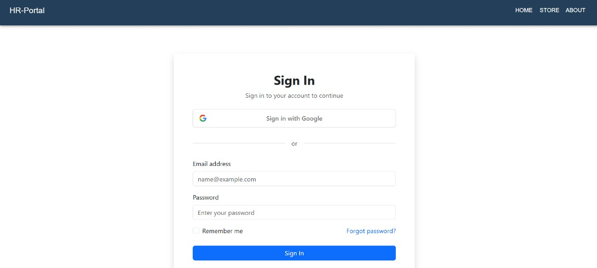
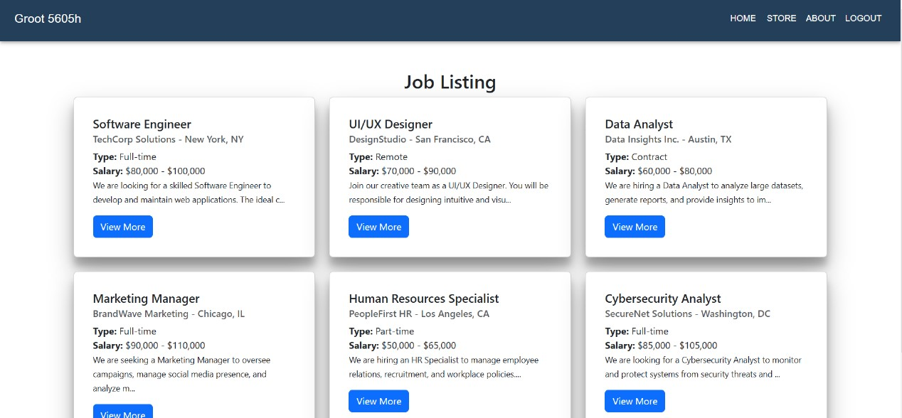
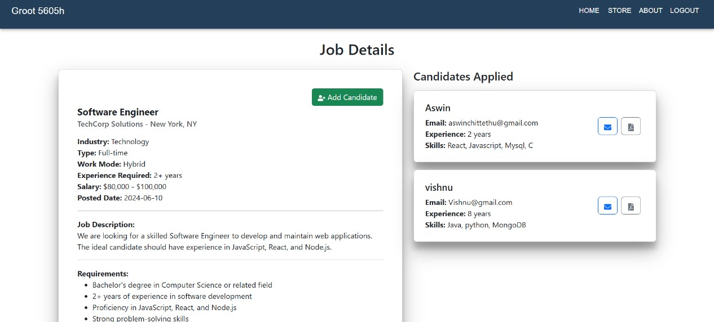
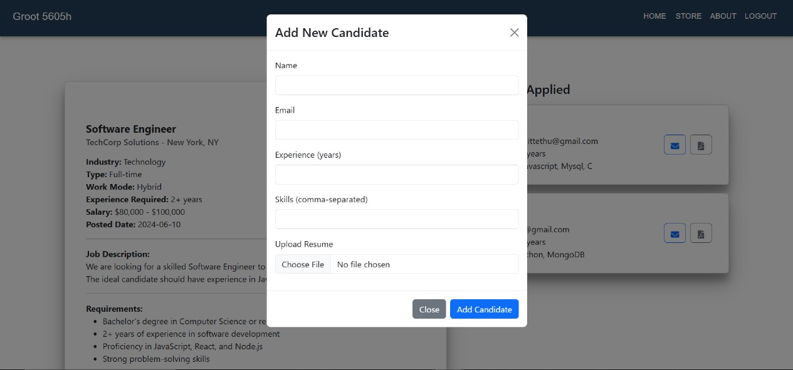
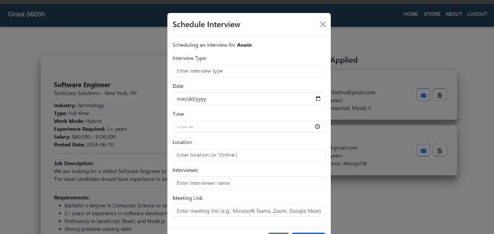
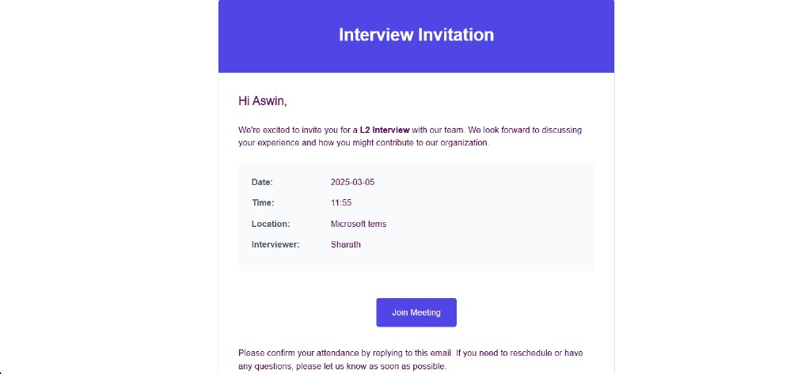

# HR Careers Portal

## 📌 Project Overview
HR Careers Portal is a web application designed to help HR professionals manage job listings and candidates efficiently. HR users can:
- Add candidates to job listings.
- Upload and view resumes.
- Schedule interviews and send email invitations.
- Authenticate securely using Google Sign-In.

---

## 📸 Screenshots
> Add your site screenshots here by uploading images to the repository and linking them.

- **Google SignIn**
  

- **Job Listings**
  

- **Job Details**
  

- **Add Candidate**
  

- **Schedule Interview**
  

- **Interview Invitation**
  


---

## 🚀 Features
- **Job Management**
  - View job listings.

- **Candidate Management**
  - Add candidates to specific job listings.
  - Upload resumes with file storage using Multer.
  - View candidate details and download resumes.

- **Interview Scheduling**
  - Schedule interviews with candidates.
  - Send email invitations to candidates with interview details.
  - Emails include date, time, location, interviewer, and meeting link.

- **User Authentication**
  - Secure login with **Google OAuth 2.0**.
  - Protected routes for HR users.

---

## 🛠️ Tech Stack
- **Frontend:** React, React Bootstrap, TypeScript
- **Backend:** Node.js, Express.js, TypeScript, MongoDB, Mongoose
- **Authentication:** Google OAuth 2.0 (`react-google-login`)
- **File Upload:** Multer
- **Email Service:** Nodemailer

---

## 📥 Installation & Setup

### Clone the Repository
```sh
git clone https://github.com/AswinSreehari/HR-Portal.git
cd hr-careers-portal
